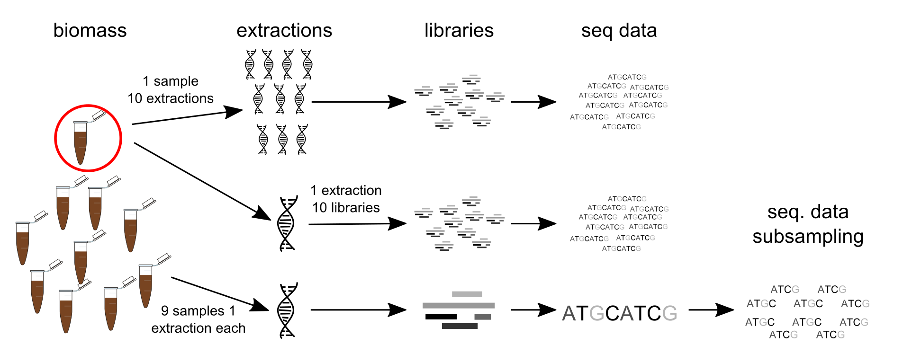

# Introduction
This report documents the analysis of 16S rRNA gene amplicon sequencing data produced on MinION (Oxford Nanopore Technologies) and MiSeq (Illumina). The analysis concerns data produced both onsite a full-scale wastewater treatment plant and in the laboratory at Aalborg Univsersity. As such, the analyses in the report concerns an onsite data analysis and a chapter on comparisons. See [Andersen et al. XXXX](<Link to manuscript>) for further details.

Raw sequencing data is available in the European Nucleotide Archive with the project ID [<ProjectID>](<link to archive>).

#### Load R libraries and set options
Install packages
```{r install_libs, eval=F}
install.packages("Rcpp")
install.packages("htmltools")
install.packages("stringi")
install.packages("readr")
install.packages("tidyselect")
install.packages("lazyeval")
install.packages("later")
install.packages("promises")
install.packages("covr", dependencies = T)
install.packages("scales")
install.packages("dplyr", dependencies = T)
install.packages("reshape2", dependencies = T)
install.packages("gridExtra")
install.packages("tidyr")
install.packages("haven")
install.packages("cellranger")
install.packages("readxl")
install.packages("tidyverse", dependencies = T)
install.packages("ggthemes")
install.packages("knitr")
install.packages("kableExtra")
install.packages("curl")
install.packages("ape")
install.packages("ggrepel")
install.packages("vegan")
install.packages("remotes")
remotes::install_github("MadsAlbertsen/ampvis2")
```

Amplicon analysis is performed using the [ampvis2 package](https://github.com/MadsAlbertsen/ampvis2).
```{r load_libs, warning=FALSE, message=F, echo=T}
library(data.table)
library(dplyr)
library(reshape2)
library(gridExtra)
library(tidyverse)
library(scales)
library(ggthemes)
library(knitr)
library(kableExtra)
library(ampvis2)
```
\pagebreak

```{r set-options, echo = FALSE, cache = FALSE}
library(knitr)
options(width = 600)
opts_knit$set(root.dir = getwd())
```


# Impact of Nanopore errors
```{r child = "rmd_files/np_error_impact.Rmd", eval=T}
```

# Flowchart of experimental workflow
```{r workflow, fig.width=15, fig.cap="Experimental workflow"}

```
\pagebreak

# Comparison of the Illumina and Nanopore sequencing platforms
```{r child = "rmd_files/platform_comparison.Rmd", eval=T}
```


# Estimating the variance in sequencing data
```{r child = "rmd_files/variance_estimation.Rmd", eval=T}
```


# Development of an onsite sequencing workflow
```{r child = "rmd_files/workflow_development.Rmd", eval=T}
```


# Onsite application of the developed workflow
```{r child = "rmd_files/onsite_microthrix.Rmd", eval=T}
```
